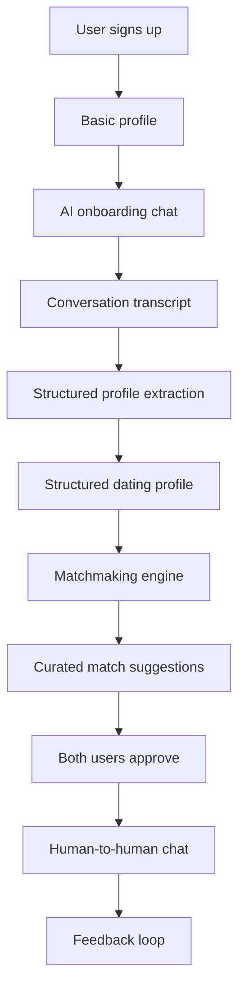

# Omiryn Architecture

## Goal

Build a high-trust AI matchmaking platform where agent conversations create
structured relationship profiles and the platform suggests fewer, better
matches.

## Core User Flow

## Service Boundaries

| Service | Responsibility |
| --- | --- |
| Auth | Login, sessions, account status, identity verification hooks |
| User Profile | Basic profile, photos, location, relationship preferences |
| Agent Chat | AI onboarding conversations and follow-up interviews |
| Extraction | Converts transcripts into validated structured dating profiles |
| Matchmaking | Hard filters, compatibility scoring, candidate generation |
| Recommendation | Ranking, explanations, and weekly match batches |
| Human Chat | Messaging after both users approve a match |
| Safety | Moderation, reporting, blocking, sensitive-content detection |
| Notifications | Email, push, WhatsApp, and match reminders |
| Admin | Manual review, curation, safety operations, support |

## AI Components

| Component | Role |
| --- | --- |
| Onboarding Interview Agent | Learns the user's goals, values, lifestyle, and preferences |
| Profile Extraction Agent | Produces structured JSON from the onboarding transcript |
| Profile Validator | Checks confidence, missing fields, contradictions, and hallucination risk |
| Match Explanation Agent | Explains compatibility and possible friction in plain language |
| Conversation Coach | Suggests openers or replies while the user remains the sender |
| Safety Classifier | Detects abuse, coercion, scams, minors, and policy violations |

## Data Stores

| Store | Suggested Choice | Data |
| --- | --- | --- |
| Relational DB | PostgreSQL | Users, profiles, matches, chat metadata, feedback |
| Vector Index | pgvector initially | Profile embeddings and conversation summaries |
| Object Storage | S3-compatible | Photos and private media |
| Cache/Queue | Redis + queue worker | Async extraction, scoring, notifications |
| Analytics | PostHog/Mixpanel later | Funnel, match quality, retention |

## Matching Strategy

The first version should use a hybrid scoring system:

1. Hard filters: age, location, relationship intent, dealbreakers, safety.
2. Structured scoring: values, lifestyle, communication, family expectations.
3. Embedding similarity: nuanced free-text preferences and personality signals.
4. Feedback learning: accepted matches, rejected matches, chats, dates.
5. Human review: useful early while the dataset is small.

## Privacy Rules

- AI involvement must be visible to users.
- AI should not secretly impersonate a user.
- Raw agent transcripts should be encrypted and retention-limited.
- Structured profile fields should be editable by the user.
- Sensitive fields should support field-level encryption.
- Deleting an account should delete or anonymize derived data.
- Match explanations should not expose private information without consent.
