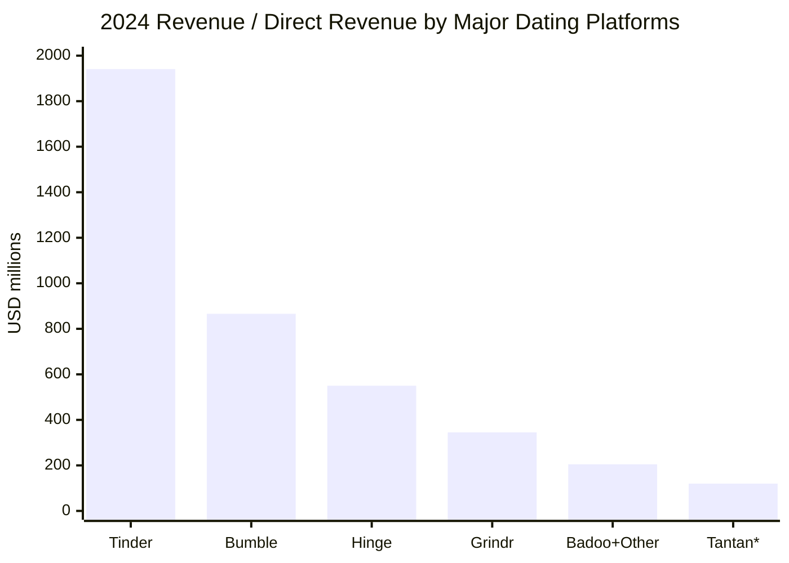
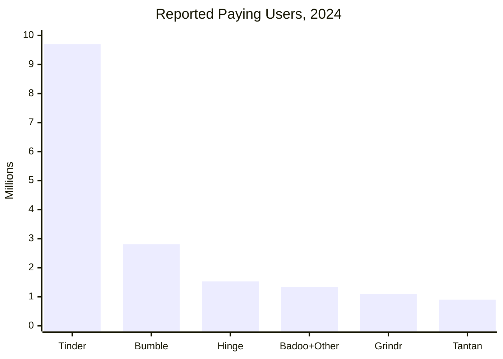

# Dating Platform Market Research

Updated: 2026-06-09

## Executive Summary

The large dating market is dominated by subscription and in-app purchase models. Tinder is still the largest revenue engine, Hinge is the fastest-growing large Match Group brand, Bumble is large but under pressure, Grindr is smaller but monetizes a focused LGBTQ+ community well, and Badoo/happn have huge registered-user counts but less transparent active-user economics.

For Omiryn, the white space is not "more swiping." It is:

```text
AI dating companion -> structured relationship profile -> fewer daily matches -> support before/after dates
```

This attacks the current market weakness: dating app fatigue, low trust, and poor match quality.

## Data Caveats

- Public companies report revenue, payers, and ARPPU/RPP more reliably than MAU by country.
- "Registered users" is not the same as active users.
- App-specific country user counts are usually third-party estimates based on traffic, downloads, panels, or app intelligence.
- For strategic decisions, use official filings first; use third-party country data only directionally.

## Large Platform Snapshot

| Platform | Parent | HQ / Origin | Scale Signal | 2024 Revenue / Revenue Signal | Paying Users | Main Revenue Streams | Confidence |
|---|---|---|---:|---:|---:|---|---|
| Tinder | Match Group | USA | ~75M MAU widely estimated | $1.94B direct revenue | 9.7M payers | Plus/Gold/Platinum, boosts, super likes, ads/indirect | High for revenue/payers, medium for MAU |
| Hinge | Match Group | USA | 10M+ users; serious-dating position | $550M direct revenue | 1.53M payers | Hinge+, HingeX, Roses, Boosts | High for revenue/payers |
| Bumble | Bumble Inc. | USA | 50M+ registered/claimed; 2.8M paying | $866M Bumble app revenue | 2.81M Bumble payers | Premium, Premium+, Boost, Spotlight, SuperSwipe | High for revenue/payers |
| Badoo | Bumble Inc. | UK origin / global | 460M+ registered claimed by third parties; 190 countries | $205M Badoo and Other revenue | 1.34M Badoo and Other payers | Premium, credits, boosts, ads/other | High for revenue/payers, low-medium for active users |
| Grindr | Grindr Inc. | USA | 14.2M avg MAU | $345M total revenue | 1.1M paying users | XTRA, Unlimited, Boost, ads | High |
| Tantan | Hello Group | China | 10.8M MAU Dec 2024 | Segment revenue declining | 0.9M paying users | VIP, live/social, subscriptions | High for MAU/payers |
| happn | happn / Hello Group acquired 2025 | France | 180M+ registered/users claimed | private; third-party estimates much lower revenue | not public | Premium, boosts, ads/partnerships | Medium for registered count, low for revenue |
| Plenty of Fish | Match Group | Canada origin / USA parent | 150M registered historically | inside Match "Evergreen & Emerging" | not separately disclosed | Premium, tokens, ads | Medium-low |

### Revenue Scale Chart



`Tantan*` is a rough directional estimate from Hello Group segment disclosures/transcripts, not as cleanly disclosed as Match/Bumble/Grindr.

### Paying Users Chart



## Platform Details

### Tinder

**Customer base**

- Largest mainstream dating app by revenue.
- ~75M MAU is a common third-party estimate, but Match Group reports payers and revenue more reliably than MAU.
- 2024 payers: 9.696M.

**Revenue**

- 2024 direct revenue: $1.94B.
- RPP: $16.68.
- Monetization: Tinder Plus, Gold, Platinum, Super Likes, Boost, Top Picks, Passport, ads/indirect revenue.

**Country footprint**

- Available globally; major markets include US, Brazil, UK, India, Mexico, Germany, Turkey.
- Official country-level active users are not disclosed.
- Third-party country numbers should be treated as directional.

**Strategic read**

Tinder owns casual discovery and top-of-funnel scale, but user fatigue and payer decline create space for higher-trust, lower-volume matching.

## Hinge

**Customer base**

- Positioned around intentional dating and "designed to be deleted."
- 2024 payers: 1.532M.
- Growth is strong compared with Tinder.

**Revenue**

- 2024 direct revenue: $550M, up 39%.
- RPP: $29.94, highest among Match Group reported segments.
- Monetization: Hinge+, HingeX, Roses, Boosts.

**Country footprint**

- Strongest in English-speaking markets: US, UK, Canada, Australia; expanding internationally.
- App-specific user by country is not officially disclosed.

**Strategic read**

Hinge is closest to Omiryn's "quality over quantity" positioning, but still relies mostly on profiles, likes, and premium ranking. Omiryn can differentiate through continuous companion memory and structured compatibility.

## Bumble

**Customer base**

- Women-first mainstream dating brand.
- 2024 Bumble App paying users: 2.807M.
- Bumble Inc. total paying users: 4.149M including Badoo and other apps.

**Revenue**

- 2024 Bumble App revenue: $866M.
- Bumble App ARPPU: $25.72.
- Monetization: Premium, Premium+, Boost, Spotlight, SuperSwipe.

**Country footprint**

- Strong in US and other English-speaking markets; meaningful India presence.
- Official country-level active users are not disclosed.

**Strategic read**

Bumble shows that better social framing matters, but fatigue and declining ARPPU show users need more outcome-oriented help than another paid visibility layer.

## Badoo

**Customer base**

- One of the broadest global footprints: 190 countries, 47 languages.
- Registered-user claims are very high, often 460M+ or higher, but active-user quality is less transparent.
- Bumble reports Badoo together with "Other," so exact Badoo-only performance is not clean.

**Revenue**

- 2024 Badoo App and Other revenue: $205M.
- 2024 Badoo App and Other paying users: 1.342M.
- ARPPU: $11.85.

**Country footprint**

- Historically strong in Europe and Latin America; Brazil is often cited as a major market.
- Official country active users are not disclosed.

**Strategic read**

Badoo proves global localization matters. But the brand is less premium and less relationship-intent focused.

## Grindr

**Customer base**

- Focused LGBTQ+ community, strongest network effect in its niche.
- 2024 average MAU: 14.2M.
- 2024 average paying users: 1.1M.
- EU average monthly active recipients in 2024: 2.4M.

**Revenue**

- 2024 total revenue: $345M.
- 2024 direct revenue: $291M.
- 2024 indirect/ad revenue: $54M.
- ARPPU: $22.53.

**Revenue streams**

- XTRA subscription.
- Unlimited subscription.
- Boost add-on.
- Advertising/indirect revenue.

**Country footprint**

- Strong in US, Brazil, Mexico, Europe, India by downloads/traffic.
- Official country-level user base is limited; EU DSA reporting gives one regional active-recipient number.

**Strategic read**

Grindr proves niche density is powerful. Omiryn should consider a narrower initial community rather than trying to beat Tinder broadly.

## Tantan

**Customer base**

- China-focused dating/social app owned by Hello Group.
- Dec 2024 MAU: 10.8M, down from 13.7M in Dec 2023.
- Q4 2024 paying users: 0.9M, down from 1.2M.

**Revenue streams**

- VIP subscriptions.
- Live/social revenue.
- Value-added services.

**Strategic read**

China dating/social products often blend dating, livestreaming, social discovery, and monetized virtual goods. This is different from Western subscription-heavy dating.

## happn

**Customer base**

- Location/crossed-paths dating app.
- Official site says +180M users worldwide.
- Strong communities cited in Western Europe, South America, Turkey, and India.

**Revenue streams**

- Premium subscription.
- Visibility boosts / credits.
- Ads and partnerships.

**Strategic read**

happn's real-world proximity thesis is useful: Omiryn can combine emotional profile understanding with practical local feasibility.

## Plenty of Fish

**Customer base**

- Older mass-market dating brand.
- 150M registered-user figure is widely cited historically.
- Still part of Match Group's Evergreen & Emerging portfolio.

**Revenue streams**

- Premium subscription.
- Tokens / boosts.
- Ads.

**Strategic read**

Large old dating networks can have high registered numbers but lower current cultural relevance. Active quality matters more than lifetime registrations.

## Users by Country: What Is Knowable

### Overall Dating-App Users by Country

Statista Consumer Insights data reported:

| Country / Region | Signal |
|---|---|
| United States | ~60.5M dating app users in 2024 |
| South Korea | high penetration, 10.8% |
| Germany | 9.0% penetration |
| Brazil | 7.8% penetration |
| United Kingdom | 6.3% penetration |
| China | 5.8% penetration, huge absolute market |
| India | 1.9% penetration, low penetration but huge upside |

### Platform-Level Country View

| Platform | Country Strengths | Data Quality |
|---|---|---|
| Tinder | US, Brazil, UK, India, Mexico, Europe | Medium; mostly third-party estimates |
| Bumble | US, India, UK, Canada, Australia | Medium; traffic/download estimates |
| Hinge | US, UK, Canada, Australia; expanding | Medium-low by country |
| Badoo | Brazil, Europe, Latin America, Eastern Europe | Medium-low |
| Grindr | US, Brazil, Mexico, India, EU | Medium; downloads + EU official active-recipient report |
| Tantan | China | High |
| happn | Western Europe, South America, Turkey, India | Medium-low |

## Pricing Models

| Platform | Subscription Tiers | A La Carte | Ads / Other |
|---|---|---|---|
| Tinder | Plus, Gold, Platinum | Boost, Super Like, Top Picks | Ads / indirect |
| Hinge | Hinge+, HingeX | Roses, Boosts, Superboost | Low emphasis |
| Bumble | Boost, Premium, Premium+ | Spotlight, SuperSwipe | Some ads/other |
| Grindr | XTRA, Unlimited | Boost | Significant ads/indirect |
| Badoo | Premium | Credits, boosts | Other revenue |
| Tantan | VIP / premium | Virtual/social features | Live/social revenue |
| happn | Premium | Boosts/credits | Ads/partnerships |

## Revenue Stream Patterns

Most large dating apps monetize through:

1. **Subscription access**
   Unlimited likes, advanced filters, incognito, seeing who liked you.

2. **Priority distribution**
   Boosts, Super Likes, Roses, priority likes, skip-the-line.

3. **Attention marketplace**
   Users pay to become more visible or signal stronger interest.

4. **Advertising**
   More important for apps with high free usage, e.g. Grindr indirect revenue.

5. **Virtual/social monetization**
   More common in China/Asia social-dating apps like Tantan/Momo.

## Market Pain Points

1. **Dating app fatigue**
   Sensor Tower reported 3Q24 global downloads and MAU declines for the cohort, with US trends weaker.

2. **Payer pressure**
   Tinder payers declined 7% in 2024 while revenue grew only 1%, mainly from RPP increases.

3. **Quality mismatch**
   Users pay for visibility, not necessarily better compatibility.

4. **Trust and safety**
   Verification, scams, harassment, and sensitive-data handling remain major issues.

5. **Gender imbalance**
   Many swipe apps over-index male users, which hurts marketplace health.

## Strategic Implications for Omiryn

### Where Omiryn Should Not Compete

- Do not launch as a generic swipe app.
- Do not monetize mainly by making users buy more visibility.
- Do not optimize for endless engagement with the AI companion.

### Where Omiryn Can Win

1. **Companion from day one**
   User is not alone while dating.

2. **Structured relationship profile**
   Richer than photos/bio/prompts.

3. **Daily curated matches**
   1-3 best matches instead of infinite swiping.

4. **Trust-first consent**
   User reviews what the AI knows before it enters matching.

5. **Niche launch**
   Start with one high-intent community, such as Indian serious dating, diaspora Indians, or verified urban professionals.

## Recommended Omiryn Pricing Benchmarks

### India MVP

| Plan | Price | Value |
|---|---:|---|
| Free | ₹0 | Limited companion chat, profile draft, weekly matches |
| Plus | ₹499/mo | Daily matches, more chat, better explanations |
| Premium | ₹1,499/mo | Better models, deeper memory, higher-quality curation |
| Concierge | ₹4,999+/mo | AI + human review/matchmaker support |

### US / Global MVP

| Plan | Price | Value |
|---|---:|---|
| Free | $0 | Limited chat and weekly matches |
| Plus | $9.99/mo | Daily matches and companion support |
| Premium | $19.99/mo | Better model routing and deeper personalization |
| Concierge | $49-99/mo | Human-assisted matching |

## Sources

- [Match Group 2024 Annual Report](https://s203.q4cdn.com/993464185/files/doc_financials/2024/ar/MTCH-10-K-2024-12-31.pdf)
- [Bumble Inc. 2024 Annual Report](https://s202.q4cdn.com/372973788/files/doc_financials/2024/ar/Bumble-Inc-Annual-Report-2024.pdf)
- [Grindr Investor Overview](https://investors.grindr.com/overview/)
- [Grindr Q4 2024 Shareholder Letter](https://investors.grindr.com/files/doc_financials/2024/q4/Grindr_Q4-2024_SHL_VFinal.pdf)
- [Hello Group FY2024 Results](https://ir.hellogroup.com/news-releases/news-release-details/hello-group-inc-announces-unaudited-financial-results-fourth-2)
- [Sensor Tower: Users Separate from Dating Apps](https://sensortower.com/blog/users-separate-from-dating-apps)
- [Statista chart: dating app users by selected countries](https://www.statista.com/chart/33943/estimated-number-of-dating-app-users-in-selected-countries/)
- [Tinder subscription features](https://www.help.tinder.com/hc/en-us/articles/115004487406-Tinder-subscriptions)
- [Hinge subscription benefits](https://help.hinge.co/hc/en-us/articles/38014282744595-Subscription-and-Purchase-Benefits)
- [Bumble paid feature pricing info](https://support.bumble.com/hc/en-us/articles/30614091973149-Pricing-information-for-paid-features)
- [Grindr Unlimited](https://www.grindr.com/unlimited)
- [happn official site](https://www.happn.com/)
