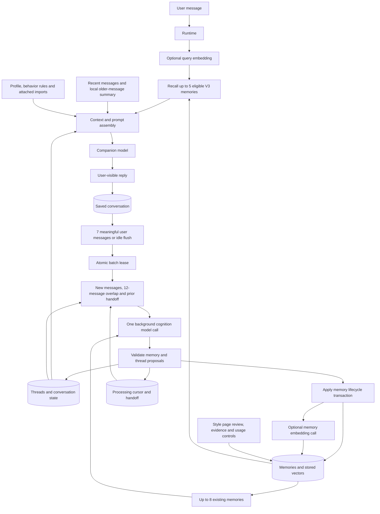
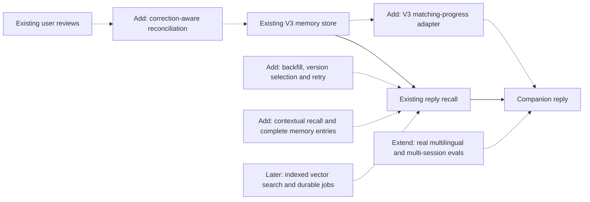

# Agent memory review — current implementation and next work

Reviewed 13 September 2026, at commit `bf8aecc`. This is a static review of the collection, lifecycle, retrieval, context, thread, provider, API and Style-page paths. No application code changed, tests ran, database records were inspected, or external model calls were made. Findings describe reachable code behavior, not measured production incident frequency.

## Assessment

The main V3 loop exists: conversation → background extraction → evidence-backed memories and threads → selected context → companion reply. It supports continuity across conversations because durable memories belong to a user. It does not train or fine-tune the companion model; the model receives selected memories as text in its prompt.

The largest remaining problem is consistency between the parts of this loop. V3 recall is wired, but matching progress still reads legacy facts, rule-based personalization remains active, and rejection/history handling has gaps. Improving these is more urgent for conversation quality than changing vector databases.

`AGENT_PIPELINE_VERSION=v3` selects live V3 memory and thread writes. Prompt behavior is configured separately: onboarding progress is assembled for prompt version `v3-1`. Semantic lookup additionally requires `MEMORY_EMBEDDING_MODEL`. This review did not inspect private environment values or verify the deployed process configuration.

## What memory means in this implementation

| Component | What it holds | How it helps |
|---|---|---|
| Recent conversation | Recent messages plus a local compact summary of older messages | Understands the immediate exchange without waiting for background extraction |
| Batch handoff | Summary, people, topics and unresolved references | Helps the next extraction batch interpret references across batch boundaries |
| Semantic memory | Explicit facts, preferences, beliefs and goals | Avoids repeatedly asking known basics; informs preferences |
| Episodic memory | Specific experiences or events | Allows relevant follow-up on the user's actual life |
| Relationship memory | Lived relationships and interpersonal history | Preserves who people are and what happened between them |
| Procedural memory | Explicit preferences for how the agent should interact | Adapts question style, tone and other interaction choices |
| Conversation threads | Topic summaries, state, depth, interest and possible next angle | Continues an unfinished discussion across sessions |
| Legacy behavior rules | Separately stored, regex-extracted interaction rules | Still influence replies, including V3; overlap with procedural memories |
| Imported context | Attached notes, WhatsApp people, chunks and style profiles | Adds context from uploads through a separate retrieval path |

`profile`, `matching` and `personalization` are purposes attached to a durable memory, not additional memory kinds. A desired partner trait is usually semantic memory with a matching purpose; relationship memory describes lived history. Working context and threads have their own lifecycle rather than being extra values in `MemoryKind`.

## Current flow

Arrows show data and control flow between modules; these are not separate deployed services.

The batch candidate search can itself make an embedding call. Memory, thread and processing-state writes are separate steps; the diagram does not imply one transaction across all three. Direct runtime replies can bypass the companion model.

### Collection

- Default trigger: 7 meaningful user messages. Assistant messages and lightweight user messages inside the batch remain available for interpretation.
- An in-process timer flushes a smaller meaningful batch after 120 seconds of inactivity. The profile-extraction endpoint explicitly schedules a flush. Closing a browser is not a guaranteed session-end flush.
- The input includes new messages, up to 12 prior messages as context, the previous handoff, up to 8 existing memories and up to 4 thread candidates.
- One model response proposes up to 12 memory operations, exactly one primary thread operation, and an updated handoff. Other topics can remain in the handoff; the implementation does not independently update every topic in a batch.
- A database lease prevents concurrent workers from freely processing the same pending batch. Application records make memory writes idempotent. Idle timers themselves are not durable across a process restart.

The batch is bounded by message count, not a strict total token limit. A long pasted message can still make extraction expensive. Earlier context outside the overlap depends on the handoff and retrieved records.

### Storage and lifecycle

| Table | Responsibility |
|---|---|
| `agent_memories` | Kind, purpose, key/value, confidence, importance, sensitivity, allowed uses, lifecycle and timestamps |
| `agent_memory_evidence` | Conversation and message pointer, source quote and observation time |
| `agent_memory_reviews` | Append-only user ratings, reasons and comments |
| `agent_memory_embeddings` | Derived vector, provider/model/dimensions and content hash |
| `memory_operation_applications` | Operation audit and retry identity |
| `memory_processing_states` / `memory_processing_leases` | Batch cursor, handoff and claim ownership |

Memory operations are `add`, `reinforce`, `supersede` and `retract`. Superseding preserves the previous record. Identical active kind/key/content can be reinforced instead of duplicated; semantic duplication under different keys still depends on model reasoning and candidate retrieval.

The application builds evidence quotes from eligible new user messages, rather than trusting the model to invent a quote. It currently uses conversation ID plus message index in that path. `observed_at` is extraction time; it is not necessarily the original message time. The schema supports message IDs, event time, validity dates, creation/update time and reinforcement time.

An extracted matching purpose does not automatically grant permission to use a memory for matching. New records start with `reply_context` permission. The Style page exposes evidence, review and usage controls; rejection retracts a record, and review history is retained.

### Retrieval and prompt

- Select active, non-expired memories with reply permission; exclude highly sensitive memories.
- Rank with lexical similarity and, when configured and compatible, embedding similarity; confidence, importance and recency also contribute.
- Select at most five: two semantic, one episodic, one relationship and one procedural memory.
- Insert compact kind/key/value text into context. The default V3 memory source budget is 1,400 characters, inside a 5,600-character budget for optional context sources. These are not limits on the whole system prompt plus chat history.
- Include up to three open/current thread references. Thread retrieval uses local hashed text vectors, not the new external memory embeddings.

The LLM receives readable selected facts, not vector numbers. Embeddings only help the backend choose records. Background handoff is used for the next extraction batch; it is not directly supplied as a foreground conversation summary.

With embeddings configured, a normal model-generated reply makes a query embedding call before the companion call. A successful background batch can make a candidate-query embedding call, one cognition call, and a memory-indexing embedding call. Embedding calls are separate from generative calls but still have latency and usage.

## Review findings

### 1. High: onboarding progress ignores canonical V3 memory

[`build_matching_understanding`](../src/agent/context_engine/assembly/matching.py) reads `list_profile_facts`, while V3 extraction writes `agent_memories`. The reply can receive a preference while the progress planner still treats its dimension as unknown. This can cause repeated onboarding questions.

Recommended: project eligible V3 memories into the progress model through a single adapter. Preserve the distinction between knowledge useful for conversation and permission to use it in matching. Do not create a second independently extracted copy of the same fact.

### 2. High: rejected knowledge can return, and approval can revive superseded knowledge

[`select_reconciliation_candidates`](../src/agent/memory_engine/memories/reconciliation.py) supplies only active memories. The extractor cannot see a previous rejection, so a later mention can lead to a fresh addition of the same rejected claim. Separately, [`review_agent_memory`](../src/storage/memory_reviews.py) sets any approved record to active, including a superseded one, without checking its replacement. That can revive conflicting versions.

Recommended: retain a bounded relevant correction/rejection history for reconciliation, with explicit rules for a later user reversal. Keep approval/reversal consistent with the supersession chain and active-key uniqueness. A stored review comment currently does not automatically correct the memory value or teach the extractor its meaning.

### 3. High: V3 still runs a separate hardcoded learning path

[`capture_profile_facts_from_user_message`](../src/agent/memory_engine/engine.py) guards legacy fact rules by policy, but calls behavior extraction outside that guard. [`behavior/extraction.py`](../src/agent/memory_engine/behavior/extraction.py) contains English regex and topic keyword rules. The resulting rules enter reply context alongside procedural memories.

Recommended: choose one canonical learning owner for V3 interaction preferences and reconcile existing behavior records. This avoids two stores disagreeing about how to talk to a user. Imported-context selection also retains keyword gates; external memory embeddings do not replace those paths.

### 4. Medium: recall can insert irrelevant facts and lose useful context

[`retrieval.py`](../src/agent/memory_engine/memories/retrieval.py) ranks eligible memories but has no minimum relevance requirement before selection. It may insert unrelated high-confidence facts. The fixed kind caps can also exclude a third highly relevant semantic fact. Lookup uses only the latest user text, so a short reference such as “what happened after that?” has little retrieval context.

The compact prompt source in [`sources.py`](../src/agent/context_engine/assembly/sources.py) omits event dates, confidence and evidence context; the character budget can truncate it mid-record. A dated event may reach the model without its time qualifier.

Recommended: use relevant recent conversational context to resolve the query, allow zero recalled content facts, make selection respect useful diversity without rigidly discarding needed facts, and budget complete memory entries with essential temporal qualifiers. Evaluate these changes rather than hardcoding particular words or examples. Also honor `valid_from`, which reply eligibility currently does not check.

### 5. Medium: vector maintenance and model-version selection are incomplete

Existing memories need a backfill. Indexing failures return zero, with no durable retry job. Unchanged memories are re-embedded because the saved content hash is not used to skip work. Retrieval and reconciliation collapse all stored embedding versions into a dictionary keyed only by memory ID; if several versions exist, a nonmatching version can overwrite the compatible one and cause lexical fallback.

Recommended: select by provider/model/dimensions before mapping; validate content freshness; add bounded, restartable backfill and failed-index retry; skip unchanged content. Foreground embeddings also use the general provider timeout, so failover to lexical retrieval may be slow during provider trouble. Give that optional path an appropriate latency budget.

### 6. Medium: conversation deletion leaves related records behind

[`delete_conversation`](../src/storage/conversations.py) deletes memories that lose their last evidence, but does not remove those memories' embeddings or reviews. Their schema columns have no database foreign-key cascade. Explicit single-memory deletion does perform this cleanup.

Recommended: centralize cleanup for all deletion entry points. This finding is about retained orphan records; normal retrieval still starts from existing memories, so it does not establish that these orphan vectors are used in replies.

### 7. Production limitation: query cost and scheduling need a later upgrade

[`list_agent_memories`](../src/storage/memories.py) reads every owned memory and then loads evidence per record. Both recall and reconciliation use this path before selecting a few records. Similarity runs in Python over JSON vectors. Idle timers are local tasks, and shutdown cancels them.

Recommended: first avoid loading unused evidence and add bounded database candidate queries. Add indexed `pgvector` search and durable background scheduling when scale/reliability requires them. Extending a lease through every expensive stage also merits a concurrency regression test: it currently covers the configured cognition timeout plus 30 seconds, while embedding calls and storage work occur inside that interval too.

## Next additions and their effects

The dashed arrows below are proposed work, not existing connections.

| Work order | Change | User-visible benefit | Evidence needed to call it done |
|---|---|---|---|
| 1 | Connect progress to V3; make review lifecycle consistent; resolve duplicate personalization ownership | Fewer repeated questions; corrections remain respected | Remember a preference, change/reject it, resume another session, check both progress and reply |
| 2 | Correct vector version selection; backfill/retry/skip unchanged; fix deletion cleanup | Older memories become findable without repeated indexing cost | Model switch, retry, unchanged input and deletion lifecycle cases |
| 3 | Contextual and selective recall; preserve dates and full entries | Relevant follow-ups without unrelated or stale facts | Ambiguous follow-ups, no-relevant-memory cases, dates, more than two relevant facts |
| 4 | Extend existing evals through real embedding and companion calls | Measured improvement in memory use | English/Hindi/Hinglish/Tamil, corrections, session gaps, rejection, naturalness, token/latency comparisons |
| Later | Database vector index and durable work scheduling | Stable performance and fewer missed updates under load/restarts | Size/load measurements and restart recovery |

Existing memory extraction, lifecycle, retrieval-stress and memory-use evals should be extended. Tests of cross-language vector selection currently include manually supplied vectors; those verify selection mechanics, not the embedding provider's language quality. No current pass-rate or subjective quality claim is made by this review.

## Expected end-user experience

Examples below are desired behavior, not outputs observed in a live run.

1. User previously said they enjoy quiet places. Later: “Any ideas for a first date?” The agent can suggest a calm setting rather than restarting the preference interview.
2. User shared a difficult conversation with a sibling. Later: “We finally talked.” Recent context plus the relevant relationship/event memory should help the agent follow the story, while asking for clarification if the reference is ambiguous.
3. User changes location or rejects an inferred preference. Subsequent replies and progress should use the correction and stop resurfacing the rejected claim.
4. User prefers one question at a time. Procedural memory should shape the reply quietly, without announcing a stored rule.
5. The user changes language. Compatible multilingual embeddings should help retrieve the same relevant memory; live evals must establish how reliably this works.

Memory gives the model useful context for better questions and continuity. Warmth, humor, initiative and good listening still depend on the companion model and conversation policy. The current idle cognition scheduler collects memory; it does not send a new unsolicited companion message. Proactive conversation needs a separate trigger, decision, delivery and cancellation path before that experience can be claimed.

The desired outcome is that the user repeats less, feels accurately understood, sees their corrections respected, and can continue a meaningful conversation. More records or more embeddings alone do not demonstrate that outcome.
